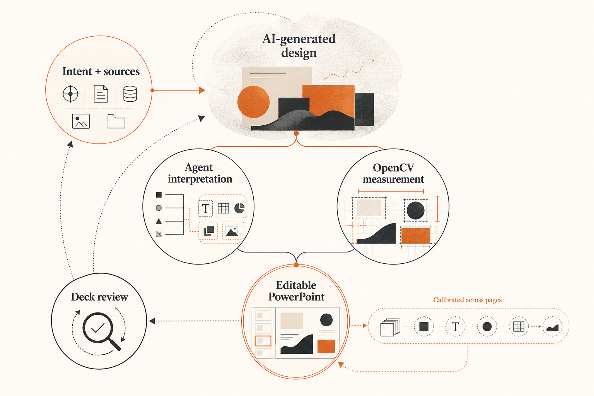
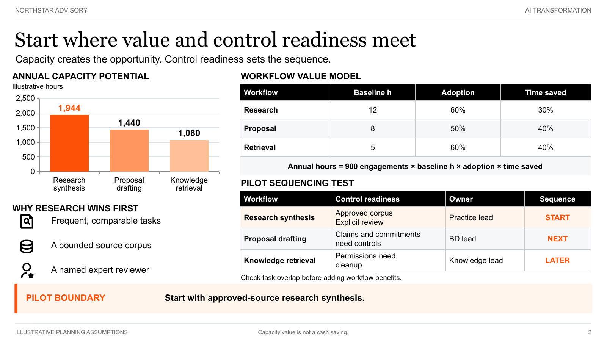
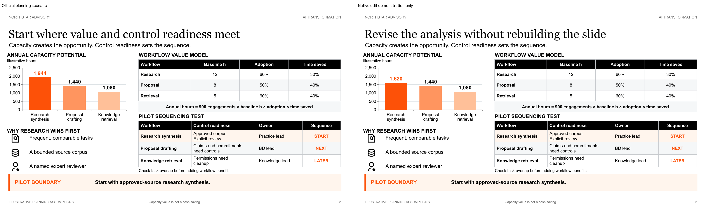

# SlidePoise

**Presentation design beyond fixed templates, reconstructed as editable PowerPoint.**

SlidePoise is an open-source Codex skill for designing complete presentations. You develop the argument with the Agent and bring the references and visual assets that matter. Image generation can then explore each composition without squeezing the content into a fixed template.

The Agent interprets the chosen design, OpenCV measures its geometry, and local tools reconstruct the deck with editable text, charts, tables, shapes and canonical visual assets. The Agent reviews the rendered slides together for fidelity and consistency.



[Get started](#get-started) · [Usage guide](docs/USAGE.md) · [Architecture](docs/ARCHITECTURE.md) · [Contribute](CONTRIBUTING.md)

## Sample presentations

Browse the slides, compare the AI designs with actual PowerPoint renders, and inspect each page’s element groups and OpenCV measurements on the [project page](https://www.henryw.me/slidepoise/).

| Consulting sample | Editorial sample |
| --- | --- |
|  |  |
| **Consulting** · Priorities, responsibilities and an investment decision for an AI pilot. | **Editorial** · An essay about working with AI and developing a point of view. |
| [Download PowerPoint](examples/consulting-ai-transformation/deliverables/presentation.pptx) | [Download PowerPoint](examples/personal-thinking-system/deliverables/presentation.pptx) |

The strategy sample uses a fictional firm and illustrative figures.

To open the project page locally, serve the checkout with `python -m http.server 8000` and visit `http://localhost:8000/docs/site/`.

## Get started

Have **Python 3.10+, Node.js 18+, npm 9+, and Codex with image generation** available, then run

```bash
npx github:henryhyw/slidepoise setup
```

Setup installs the local tools and registers the skill. It also installs missing preview tools through Homebrew on macOS, winget on Windows, or apt on Debian/Ubuntu. Your system may request administrator access. Use fonts available on your machine.

<details>
<summary>Installation contents and optional dependencies</summary>

`npx` installs the Python measurement tools and Node.js PowerPoint renderer under `~/.slidepoise`. It registers the skill in `~/.codex/skills/slidepoise` when Codex is detected, and copies the bundled Profiles and Library Sets.

Python dependencies include Pillow, python-pptx, NumPy and OpenCV. The Node runtime uses PptxGenJS and JSZip. LibreOffice renders PowerPoint pages. Poppler converts those pages into images for review. Setup prepares these through the system package manager and checks that both executables are available. If installation cannot finish, it reports the missing tool and exits with an error so you can resolve the issue and rerun setup. Codex, image generation and fonts are supplied by your environment.

OpenCV measures object boundaries, colour and geometry for reconstruction.

</details>

Then ask Codex for a presentation.

```text
$slidepoise

Create a five-slide presentation for our leadership team about an AI pilot.
Use the Consulting Profile. Develop a clear recommendation, make the
assumptions explicit, and show me one sample before finishing the deck.
Deliver an editable PowerPoint.
```

Ask the Agent to work autonomously if you prefer. The [usage guide](docs/USAGE.md) covers installation checks and Profile management.

## How it works

| Stage | Work |
| --- | --- |
| Plan | Decide what each slide needs to communicate and gather its supporting content. |
| Design | Generate compositions using your references and a shared visual direction. |
| Reconstruct | Identify objects, measure their geometry and build the PowerPoint. |
| Review | Compare actual renders with the designs and check consistency across pages. |

**The Agent plans the content and makes design decisions.** Image generation explores the composition using the authored content, references and shared style. The image covers the content area. Headers and footers are added as inherited PowerPoint elements, with a page-number field on each page. The content's aspect ratio is calculated after reserving this space.

**The Agent identifies objects. OpenCV measures them.** A set of bars, labels and values can belong to one chart. OpenCV measures their visible geometry. The renderer builds a native chart linked to a workbook, so its data stays editable.

**Review covers the whole presentation.** The Agent discovers repeated roles, including small labels and folios, applies their common styles to the corresponding objects, and reviews the actual renders again. The [architecture](docs/ARCHITECTURE.md) describes these responsibilities in detail.

The Agent records required content and relationships before construction. The runtime checks those declarations so a caption cannot stand in for a missing arrow. Rendered table text is checked against the actual PDF, where broken words can appear despite valid font settings. The Agent then inspects the images for layout, emphasis and fidelity. See the [reconstruction audit](docs/quality/reconstruction-audit.md) for the defects this review uncovered and the corrections.

Below, an edited copy has a new title and a chart value changed from 1,944 to 1,620. The bar and its label update in PowerPoint.



## Bring your own visual language

Library Sets hold the icons, logos, visual references and reusable PowerPoint components that belong to your work. The Agent inspects those resources while planning a slide and selects the ones that improve recognition, structure or meaning. Empty asset selection is a design decision that must be reviewed, especially when a presentation has an enabled visual library.

Image generation receives the selected artwork as design context. After a design is accepted, the Agent binds each visible asset role to its canonical file and reviews the available variants at the final size. Reconstruction then replaces generated stand-ins with the original SVG, image or editable component. This keeps the visual system coherent without forcing every page into the same layout.

## Visual references and Profiles

Profiles save typography, palette, density and references for future presentations. Included starting points are Consulting, Editorial Archive and Monochrome Modern. Add your own references and adapt the layout to each message.

Use the local Console to manage Profiles and Library Sets. Ask Codex to open it, or run the following command after installation.

```bash
npx github:henryhyw/slidepoise console
```

[Try the interactive Console demo](https://www.henryw.me/slidepoise/docs/site/#console). It uses sample data and does not inspect your computer.

Saved changes apply to future presentations. A session panel adjusts a presentation already in progress without changing its saved Profile.

## Editability and compatibility

Text, tables, charts, shapes, connectors and freeforms can remain native. Photographs, textures and expressive illustrations stay as regional images. Separate text and table values do not become spreadsheet formulas automatically.

The integration and samples have been tested with Codex. Local previews use LibreOffice and Poppler. Other Agent hosts need their own integration checks. Fonts are not bundled, and different fonts or Office readers can change text wrapping and appearance.

## Develop and contribute

```bash
python -m venv .venv
.venv/bin/pip install -e '.[dev,runtime]'
npm ci
PYTHONDONTWRITEBYTECODE=1 .venv/bin/python -m pytest
npm test
```

On Windows, use the executables in `.venv\Scripts`.

The self-contained skill and renderer live in [`slidepoise/`](slidepoise/). [`framework/`](framework/) contains installation and local services. [`profiles/`](profiles/) and [`library-sets/`](library-sets/) hold reusable resources. [`webapp/`](webapp/) contains the optional controls.

Read [CONTRIBUTING.md](CONTRIBUTING.md) before making changes. Report defects through [GitHub issues](https://github.com/henryhyw/slidepoise/issues) and security concerns through [SECURITY.md](SECURITY.md).

[MIT license](LICENSE)
