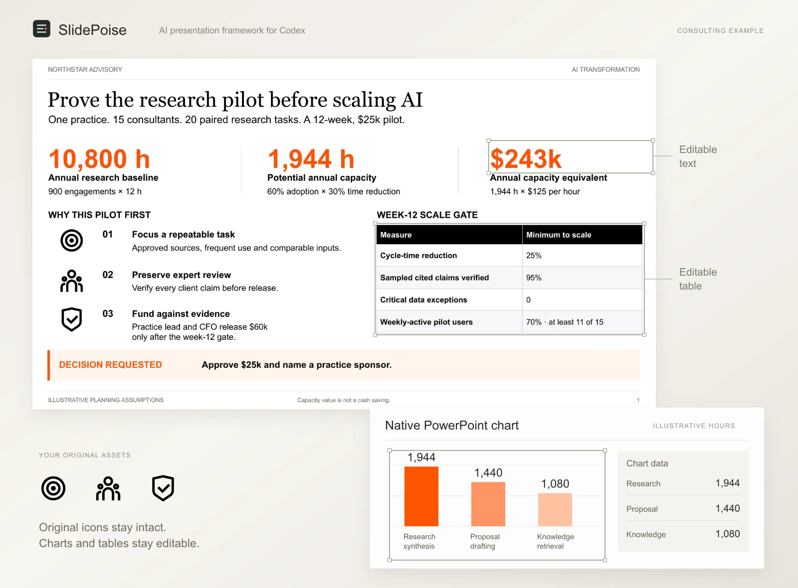
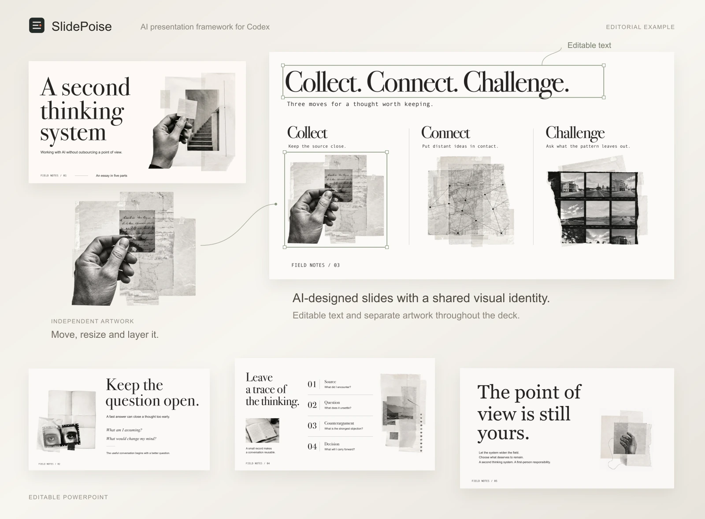
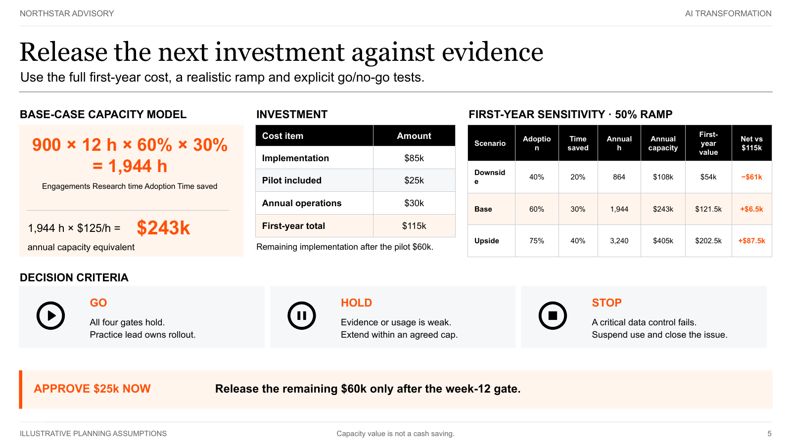
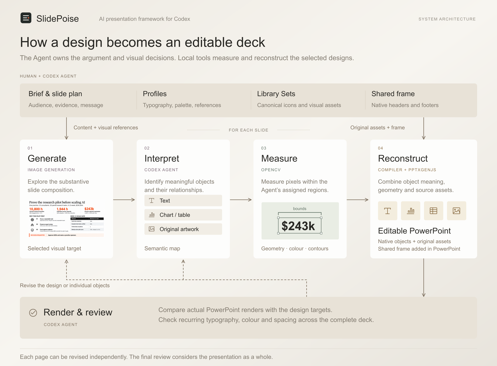

# SlidePoise

**Open-source Agentic Slide Generation Framework**

SlidePoise helps an AI Agent develop presentation content, explore designs through image generation and build editable PowerPoint slides. Your references and visual assets guide the design throughout.

## Why SlidePoise

Agentic slide generation needs both freedom of layout and control over the final deck.

Fixed templates keep layouts consistent, but restrict how content can be presented. Image generation allows freer design, yet leaves the work of maintaining consistency and turning those designs into accurate, editable slides.

SlidePoise gives that creative process a structured workflow, supported by tools for visual measurement and PowerPoint construction. A shared content plan, style and asset library guide the Agent as it develops designs, builds editable slides and reviews the resulting deck.

SlidePoise is built and tested with Codex, using its native image-generation tools. Claude Code and Qoder can run the same skill and local runtime through connected image tools, including MCP, or a manual generation exchange.

[](https://www.henryw.me/slidepoise/docs/site/)

[](https://www.henryw.me/slidepoise/docs/site/)

[Get started](#get-started) · [Usage guide](docs/USAGE.md) · [Architecture](docs/ARCHITECTURE.md) · [Contribute](CONTRIBUTING.md)

## Sample presentations

Browse the slides, compare the AI designs with actual PowerPoint renders, and inspect each page’s element groups and OpenCV measurements on the [project page](https://www.henryw.me/slidepoise/).

<table>
  <tr>
    <th width="50%">Consulting sample · Slide 5</th>
    <th width="50%">Editorial sample · Slide 4</th>
  </tr>
  <tr>
    <td width="50%"><a href="https://www.henryw.me/slidepoise/docs/site/?deck=consulting-ai-transformation&amp;slide=s05-investment-decision"></a></td>
    <td width="50%"><a href="https://www.henryw.me/slidepoise/docs/site/?deck=personal-thinking-system&amp;slide=s04-trace"></a></td>
  </tr>
  <tr>
    <td>An investment model, sensitivity table and decision criteria for an AI pilot.</td>
    <td>A visual record of sources, questions, counterarguments and decisions.</td>
  </tr>
  <tr>
    <td><a href="examples/consulting-ai-transformation/deliverables/presentation.pptx">Download Consulting PowerPoint</a></td>
    <td><a href="examples/personal-thinking-system/deliverables/presentation.pptx">Download Editorial PowerPoint</a></td>
  </tr>
</table>

The consulting sample uses a fictional firm and illustrative figures.

## Get started

### Ask your Agent

Paste this into your Agent to install and set up SlidePoise.

```text
Install and set up SlidePoise for me from https://github.com/henryhyw/slidepoise.
```

### Install from your terminal

Have **Python 3.10+, Node.js 18+, npm 9+, and an Agent with local file execution and image inspection** available, then run

```bash
npx github:henryhyw/slidepoise setup
```

Setup installs the local tools and registers the skill. It also installs missing preview tools through Homebrew on macOS, winget on Windows, or apt on Debian/Ubuntu. Your system may request administrator access. Use fonts available on your machine.

<details>
<summary>What setup installs</summary>

`npx` installs the Python measurement tools and Node.js PowerPoint renderer under `~/.slidepoise`. It registers the skill with detected Codex, Claude Code and Qoder installations, and copies the bundled Profiles and Library Sets. Use `--agent codex`, `--agent claude` or `--agent qoder` to choose explicitly.

Python dependencies include Pillow, python-pptx, NumPy and OpenCV. The Node runtime uses PptxGenJS and JSZip. LibreOffice renders PowerPoint pages. Poppler converts those pages into images for review. Setup prepares these through the system package manager and checks that both executables are available. If installation cannot finish, it reports the missing tool and exits with an error so you can resolve the issue and rerun setup. Your Agent, image-generation access and fonts are supplied by your environment.

OpenCV measures object boundaries, colour and geometry for reconstruction.

</details>

Then ask your Agent for a presentation.

```text
Use SlidePoise to create a five-slide presentation for our leadership team about an AI pilot.
Use the Consulting Profile. Develop a clear recommendation, make the
assumptions explicit, and show me one sample before finishing the deck.
Deliver an editable PowerPoint.
```

Ask the Agent to work autonomously if you prefer. The [usage guide](docs/USAGE.md) covers installation checks and Profile management.

## Choose how images are generated

In automatic mode, the Agent discovers image-generation capabilities available in the conversation, including native tools and connected MCP tools. It checks that a tool can accept the prompt and reference images and perform any requested edits before choosing it. You can ask it to use a specific tool or model and save that preference.

Prefer to generate images in another app? Tell the Agent to use manual generation. It supplies the exact prompt and an ordered reference bundle. Return the downloaded image and it continues with visual review and editable reconstruction. The same exchange supports slide corrections and transparent illustration edits.

These choices are also available under **System → Image generation** in the local Console. Defaults apply to future presentations. Ask the Agent to change just the current presentation when needed. See the [image-generation guide](docs/IMAGE_GENERATION.md) for setup and manual exchanges.

## How it works

The Agent plans what the presentation should communicate and how its slides fit together. An image model explores layouts using the content, style references and selected assets. The Agent then identifies objects and relationships in the chosen design. Local tools measure their geometry and build the PowerPoint, which the Agent reviews against the plan.

[](docs/images/slidepoise-architecture.svg)

| Stage | Work |
| --- | --- |
| Plan | Decide what each slide needs to communicate and gather its supporting content. |
| Design | Generate compositions using your references and a shared visual direction. |
| Reconstruct | Identify objects, measure their geometry and build the PowerPoint. |
| Review | Compare actual renders with the designs and check consistency across pages. |

**Planning establishes what each slide needs to communicate.** The Agent develops the message and supporting information with you. Image generation receives this content, visual references and shared style guidance, leaving the composition open. The image covers the content area. Headers and footers are added as inherited PowerPoint elements, with a page-number field on each page. The content's aspect ratio is calculated after reserving this space.

**Interpretation gives the chosen image an editable structure.** To reconstruct it in PowerPoint, the Agent identifies which elements belong together and what they represent. Bars, labels and values may form one chart. OpenCV, a computer-vision library, measures their visible geometry. The renderer combines these inputs to build a native chart linked to a workbook.

**Review covers the whole presentation.** The Agent identifies elements that should look consistent across slides, including titles, captions and page numbers. It applies shared styles and checks the rendered PowerPoint again. The [architecture](docs/ARCHITECTURE.md) describes these responsibilities in detail.

The Agent records required content and relationships before construction. It checks what each arrow should connect, correcting mistaken connections in the generated design. The runtime builds the specified routes using the connected objects’ measured geometry and checks content coverage and rendered text. The Agent uses this evidence alongside visual inspection to refine alignment, resolve text-fitting problems and preserve the intended emphasis.

Below, an edited copy has a new title and a chart value changed from 1,944 to 1,620. The bar and its label update in PowerPoint.


## Bring your own visual language

Library Sets make icons, logos and reusable PowerPoint components available to the Agent. Use the included Remix Icon integration, find images and logos through Wikimedia Commons, or add your own files. The Agent selects assets that help communicate each slide’s content.

The Agent sends the selected artwork to image generation as visual references. During reconstruction, it matches the assets shown in the design to their original files, checks which versions fit at the final size, and places those SVGs, images or editable components in PowerPoint. The same artwork can be used consistently across different slide layouts.

Small generated illustrations can be regenerated individually at higher resolution with transparent backgrounds. The Agent checks the new detail and edges, then places the artwork in its original position. Text, charts and tables remain native. The [Editorial sample’s third slide](examples/personal-thinking-system/assets/s03-practice-render.png) uses three such illustrations.

## Visual references and Profiles

Profiles save typography, palette, density and references for future presentations. Included starting points are [Consulting, Editorial Archive and Monochrome Modern](profiles/README.md). Add your own references and adapt the layout to each message.

Create and refine Profiles and Library Sets together with your Agent. Use the optional local Console to inspect or adjust them. Ask your Agent to open it, or run the following command after installation.

```bash
npx github:henryhyw/slidepoise console
```

[Try the interactive Console demo](https://www.henryw.me/slidepoise/docs/site/#console). It uses sample data and does not inspect your computer.

Saved changes apply to future presentations. A session panel adjusts a presentation already in progress without changing its saved Profile.

## Editability and compatibility

Text, tables, charts, shapes, connectors and freeforms can be built as editable PowerPoint objects. Charts retain their underlying data. Photographs, textures and illustrations are placed as separate images whose position, size and layering can be edited.

The included presentations were created with Codex. Installation, shared settings and generation handoffs are tested for Codex, Claude Code and Qoder. Image tools depend on what is connected in each conversation. Claude and Qoder end-to-end presentation runs still need verification in those hosts. Local previews use LibreOffice and Poppler. Fonts are not bundled, and different fonts or Office readers can change text wrapping and appearance.

## Develop and contribute

```bash
python -m venv .venv
.venv/bin/pip install -e '.[dev,runtime]'
npm ci
PYTHONDONTWRITEBYTECODE=1 .venv/bin/python -m pytest
npm test
```

On Windows, use the executables in `.venv\Scripts`.

The self-contained skill and renderer live in [`slidepoise/`](slidepoise/). [`framework/`](framework/) contains installation and local services. [`profiles/`](profiles/) and [`library-sets/`](library-sets/) hold reusable resources. [`webapp/`](webapp/) contains the optional controls.

Read [CONTRIBUTING.md](CONTRIBUTING.md) before making changes. Report defects through [GitHub issues](https://github.com/henryhyw/slidepoise/issues) and security concerns through [SECURITY.md](SECURITY.md).

[MIT license](LICENSE)
