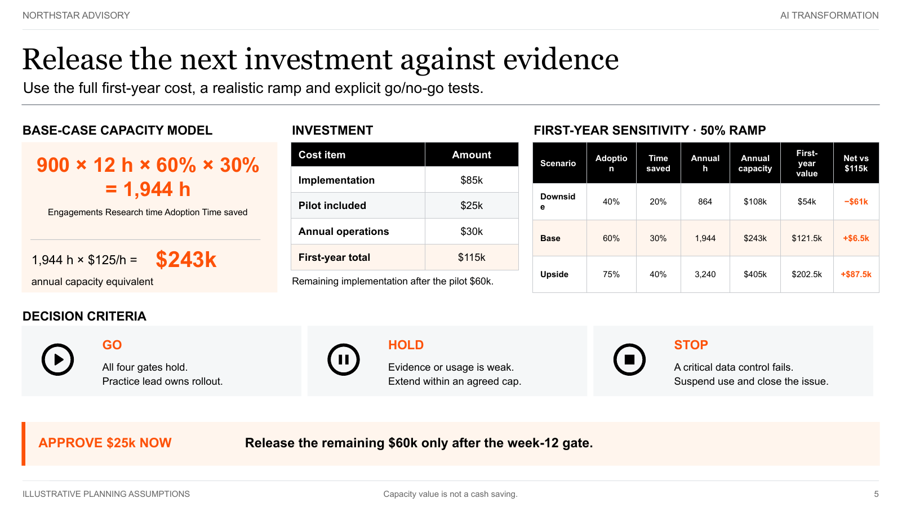
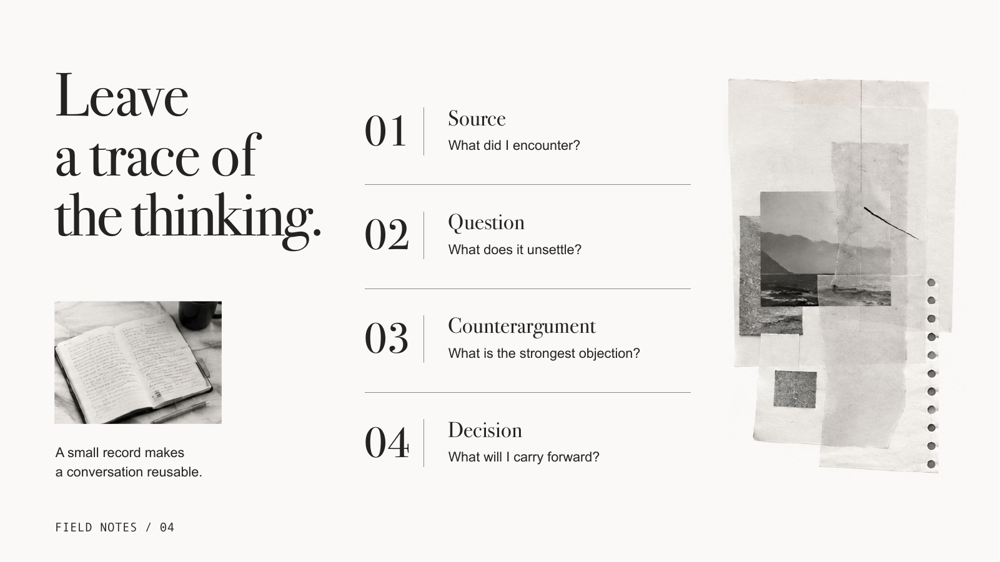
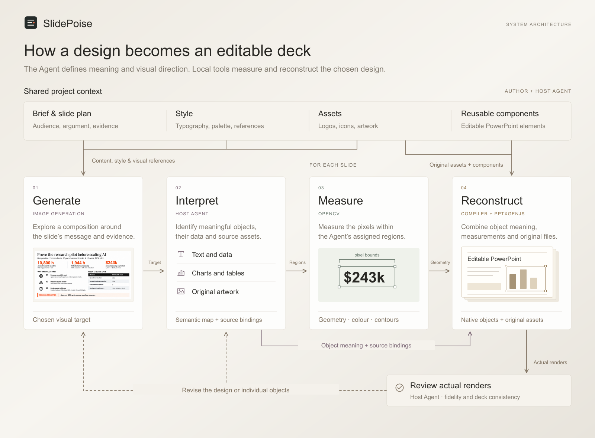
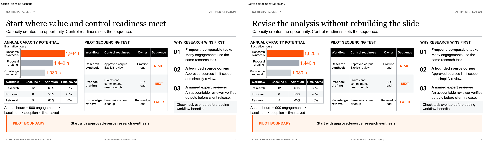

# SlidePoise

**Open-source agentic slide generation**

Create editable PowerPoint presentations with an AI Agent. SlidePoise uses image generation to explore compositions beyond fixed templates, then rebuilds the chosen designs as editable text, charts, tables and shapes. You can develop a single slide or a complete deck through conversation.

[Project website](https://slidepoise.github.io/) · [Get started](#get-started) · [How it works](#how-it-works) · [Usage guide](docs/USAGE.md)

https://github.com/user-attachments/assets/badaee09-0d19-4e5f-93dd-c98d14b39b1e

## Sample presentations

A comparison and a photographic essay need different layouts. These two decks show how SlidePoise adapts the composition to the content while maintaining a shared visual style across each presentation.

<table>
  <tr>
    <th width="50%">Consulting</th>
    <th width="50%">Editorial</th>
  </tr>
  <tr>
    <td><a href="https://slidepoise.github.io/?deck=consulting-ai-transformation&amp;slide=s05-investment-decision#examples"></a></td>
    <td><a href="https://slidepoise.github.io/?deck=personal-thinking-system&amp;slide=s04-trace#examples"></a></td>
  </tr>
  <tr>
    <td>A recommendation for an AI pilot, supported by financial assumptions, a delivery plan and decision criteria.</td>
    <td>A personal thinking system expressed through typography, photography and separate illustrations.</td>
  </tr>
  <tr>
    <td><a href="examples/consulting-ai-transformation/deliverables/presentation.pptx">Download PowerPoint</a></td>
    <td><a href="examples/personal-thinking-system/deliverables/presentation.pptx">Download PowerPoint</a></td>
  </tr>
</table>

[Explore both decks on the website](https://slidepoise.github.io/#examples) to compare the AI designs with actual PowerPoint renders and inspect individual objects. The consulting sample uses a fictional firm and illustrative figures.

## How it works

The Agent makes the content and design decisions. Local tools provide measurement, construction and rendering so the Agent can inspect what the PowerPoint actually contains.

[](docs/images/slidepoise-architecture.svg)

### Plan the content

You and the Agent establish the audience, message and supporting material. The Agent develops the slide sequence and identifies what each slide needs to communicate.

### Retrieve resources and explore the design

The Agent searches the indexed reference library for useful visual precedents, inspects relevant icons, logos and native components, then selects resources for each slide. A [contact sheet](https://slidepoise.github.io/#contact-sheet) combines their previews with the chosen style in a form you can inspect. The image model receives this sheet alongside the slide instructions. The Agent checks the generated image against the brief for content, readability and layout before reconstruction. You can review a representative design before the Agent continues or ask it to complete the deck autonomously.

### Reconstruct meaningful objects

The Agent identifies what the chosen image contains and which parts belong together. A chart’s bars, labels and values are recorded as one chart in a **semantic map**, an object-level description of the design. **OpenCV**, a computer-vision library, measures the assigned image regions. The reconstruction compiler combines those measurements with the semantic map and original assets. **PptxGenJS** builds the PowerPoint objects, including charts linked to their data.

Text, tables, shapes and connectors remain editable. Photographs, textures and illustrations are placed as separate images whose size, position and layering can be adjusted. Shared headers, footers and page numbers are added directly in PowerPoint.

<details>
<summary>See an actual PowerPoint edit</summary>

In this example, the title was edited and a chart value changed from 1,944 to 1,620. The bar and its label update in PowerPoint.



</details>

### Review the rendered presentation

The Agent compares the PowerPoint renders with the selected designs and the content plan. It checks relationships such as which objects an arrow connects, resolves text-fitting problems and reviews typography, colour and spacing across the deck. You can then revise a particular object, change one slide or reorder the presentation. Affected slides can be rebuilt individually.

The [technical architecture](docs/ARCHITECTURE.md) explains the semantic map, measurement evidence and reconstruction pipeline in detail.

## Use your own style and assets

Save fonts, colours and visual references in a **Profile**, a reusable style configuration. The included [Consulting, Editorial Archive and Monochrome Modern profiles](profiles/README.md) provide starting points that you can adapt with your Agent.

The [public PwC and Strategy& reference collection](profiles/pwc-public/README.md) includes a complete consulting deck and indexed pages from related publications. For each slide, the Agent retrieves candidates by communication purpose and information structure, then inspects and selects useful precedents. Source provenance and exclusions stay attached to the selected pages. Private references can remain in local profiles.

Keep logos, icons, artwork and reusable PowerPoint components in asset libraries called **Library Sets**. SlidePoise includes access to Remix Icon and Wikimedia Commons, and you can add your own files. Selected artwork guides image generation. During reconstruction, the Agent places the original files in the slide so their identity and detail are preserved.

Small generated illustrations can be refined separately at higher resolution, including transparent backgrounds. The Agent checks them in the chosen composition before replacing the original image regions. The [third editorial slide](examples/personal-thinking-system/assets/s03-practice-render.png) uses three such illustrations.

<details>
<summary>Manage styles and assets in the local Console</summary>

The optional Console is a browser interface for fonts, colour, references, asset libraries and image-generation settings. After installation, ask your Agent to open it or run

```bash
npx github:henryhyw/slidepoise console
```

Saved settings apply to future presentations. Ask the Agent to adjust a presentation already in progress, or use its session panel for changes that apply only to that deck.

[Try the Console demo](https://slidepoise.github.io/#console) using the website’s sample settings.

</details>

## Get started

You need **Python 3.10+, Node.js 18+ with npm 9+, and an Agent that can run local commands and inspect images**.

Codex is the primary, end-to-end tested environment. Setup also supports Claude Code and Qoder. They use the same skill and local runtime through a connected image generator or manual image exchange. See the [image-generation guide](docs/IMAGE_GENERATION.md) for platform setup and tool selection.

### Ask your Agent

Paste this into your Agent to handle installation and setup.

```text
Install and set up SlidePoise for me from https://github.com/henryhyw/slidepoise.
```

### Install from your terminal

```bash
npx github:henryhyw/slidepoise setup
```

Setup registers the skill with detected Agent platforms and installs its local tools. Use `--agent codex`, `--agent claude` or `--agent qoder` to select a platform. Restart your Agent or reload its skills afterwards.

<details>
<summary>Local tools and preview requirements</summary>

Setup prepares an isolated Python environment for OpenCV, Pillow, NumPy and python-pptx, plus a Node.js runtime for PptxGenJS and JSZip. Reusable styles and asset libraries are stored under `~/.slidepoise`.

LibreOffice and Poppler produce slide previews for review. Setup installs missing preview tools through Homebrew on macOS, winget on Windows, or apt on Debian/Ubuntu. Homebrew must already be available on macOS. These system packages may request administrator access.

Your environment supplies image-generation access and fonts. Font substitutions or a different Office reader can change text wrapping and appearance. Run the installation check if setup reports a missing tool.

```bash
npx github:henryhyw/slidepoise doctor
```

The [usage guide](docs/USAGE.md) covers installation details, updates and resource management.

</details>

### Create a presentation

Give the Agent your source material, audience and intended outcome. For example

```text
Use SlidePoise to create a five-slide presentation for our leadership team
about an AI pilot, using the attached research and cost estimates.
Make the recommendation and its assumptions clear. Use the Consulting style
and show me one sample slide before completing the editable PowerPoint.
```

To generate images in another app, ask for manual image generation. The Agent prepares the prompt and reference files, then continues when you return the image.

## Develop and contribute

The self-contained skill and PowerPoint renderer live in [`slidepoise/`](slidepoise/). [`framework/`](framework/) contains installation and local services. Reusable styles and assets live in [`profiles/`](profiles/) and [`library-sets/`](library-sets/). [`webapp/`](webapp/) contains the optional Console and session controls.

<details>
<summary>Set up a development checkout and run tests</summary>

```bash
python -m venv .venv
.venv/bin/pip install -e '.[dev,runtime]'
npm ci
PYTHONDONTWRITEBYTECODE=1 .venv/bin/python -m pytest
npm test
```

On Windows, use the executables in `.venv\Scripts`.

</details>

Read [CONTRIBUTING.md](CONTRIBUTING.md) for development guidance. Report bugs through [GitHub issues](https://github.com/henryhyw/slidepoise/issues) and security concerns through [SECURITY.md](SECURITY.md).

[MIT license](LICENSE) · [Designed by Henry W.](https://www.henryw.me/)
