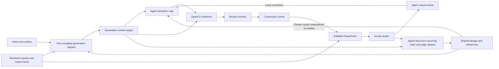

# SlidePoise architecture

SlidePoise carries a presentation from its argument and source material to a reviewed PowerPoint deck. The Agent plans the narrative, uses image generation to explore each slide and reconstructs selected designs as native PowerPoint objects. The architecture separates planning, visual exploration, semantic interpretation, pixel measurement, construction and deck review. The conversation is the working interface. A self-contained skill carries the Agent instructions and reconstruction runtime. Reusable Profiles and Library Sets live outside the skill so users can update them independently.

## Ownership

| Layer | Responsibility | Durable output |
| --- | --- | --- |
| Host Agent | Message, narrative, resource choice, semantic ownership, visual review | Outline, semantic map, reconstruction handoff, review observations |
| Generation request compiler | Resolved content canvas, intent, references and shared design | One request with the prompt, attachments and source bindings |
| Host image generation | Explore the substantive slide composition within the request | Candidate images and the selected content target |
| OpenCV measurement | Pixel bounds, ink regions, contours, colors, regional crops | Measurement JSON and diagnostic overlay |
| Reconstruction compiler | Source binding, coordinate transforms, text fitting, object construction instructions | Reconstruction contract and constructor scene |
| PowerPoint renderer | Native text, shapes, charts, connectors, freeforms and image placement | Editable PPTX |
| Artifact boundary | Ordered assembly, atomic publication, relative asset paths, closed inventory | Deck bundle, PDF, ordered previews and hashes |
| Optional local UI | Reusable resources and current-presentation overrides | Profiles, Library Sets, settings and durable events |

The Agent can revise an outline, reconsider an object or rerun one page at any point. Runtime checks reject malformed or stale inputs. They never infer beauty, decide semantic ownership or issue visual acceptance from a score.

## Division of work

### Message and composition

The Agent organizes the message, evidence and narrative before choosing a composition. Image generation explores how that material can look. The selected image becomes the visual reference for reconstruction.

### Interpretation and measurement

The Agent identifies meaningful objects and relationships in the selected image. OpenCV measures visible pixels within the regions the Agent assigned. The compiler combines those inputs to construct editable objects. The Agent reviews the render and decides what needs revision.

Deck consistency remains an Agent responsibility. The Agent defines recurring visual roles, carries those decisions into individual pages and compares the finished renders together.

## Shared frame and content canvas

The PowerPoint canvas includes the full slide and its inherited header and footer. Image generation receives the substantive region between them.

```text
content width  = full slide width
content height = full slide height - enabled header height - enabled footer height
content offset = enabled header height
```

For example, a 1920 by 1080 slide with a 64-pixel header and 56-pixel footer has a 1920 by 960 generation canvas. Its content ratio is 2:1. Reconstruction places that content below the header and adds the shared frame through PowerPoint inheritance.

Header text, footer text, page numbers and master-frame rules never belong in the generated image. Disabling a frame removes it from the output. It does not instruct image generation to draw a replacement. Page-specific qualifications can remain substantive content when the Agent gives them an explicit role.

`prepare_generation.py` compiles the resolved canvas, intent, resources and shared deck design into `generation-request.json`. The human-readable brief and request prompt are the same text. The request also lists the reference images and binds its source files by hash. The host submits that prompt with the recorded attachments. A changed instruction belongs in the upstream inputs and a newly compiled request.

Request verification detects changed source files, prompt text or attachments before a host call. It records the prepared instructions. The Agent still inspects the returned image for the requested canvas, excluded frame content and visual direction. Host call evidence records the actual submission when the integration exposes it.

Focused image edits use the same request as their base. The edit adapter binds the current candidate and the authored changes, retains the canvas and shared design, and checks the host's prompt capacity. An Agent can initiate a correction after visual review. Source changes or an oversized prompt require a new request before the next call.

## Cross-page design responsibility

The Agent records recurring visual functions in `work/deck-design.json`. Role names come from the actual deck. A caption, series label, source line, section marker or folio can matter as much as a headline. Shared wording alone does not define a role, and differently worded objects can still be peers. The configuration remains the sole source of frame geometry.

A representative generated page can serve as a style reference for later pages. The Agent revisits the role inventory when candidates arrive and after native rendering, using a contact sheet to discover repeated visual functions and full-resolution pages to inspect them. This search includes elements omitted from the initial brief. An inventory confined to familiar heading or callout categories can miss a recurring series marker whose page-local names differ.

Each discovered role carries its purpose, concrete chosen style, page/entity aliases and explicit exceptions. Page workers materialize that style in semantic-map `style_hint` values or compatible config tokens and record `recurring_role_bindings` in their handoffs. The bindings document the recipients of the decision. They do not automatically change the entities. The compiler consumes the authored entity styles and reports fitting results. Its typography groups operate within one page, so a successful fit on every page can coexist with inconsistent treatment of one deck role.

The Agent compares actual appearance with emitted native facts, including family, face, point size, tracking, color and alignment. If a style changed during fitting or font resolution, the Agent decides how to revise its allocation, content, shared treatment or explicit exception. Re-rendering closes that feedback loop. Native facts diagnose what was emitted. They never infer peerhood, select a visual treatment or issue a consistency verdict. A different layout can preserve a recurring visual system without copying one page composition.

## Reconstruction flow



Every delivered example page uses the packaged path. The examples do not contain a second PowerPoint builder. `examples/rebuild.py` only orchestrates existing commands from retained targets, semantic maps and handoffs.

Three coordinate concepts remain explicit. A search region says where measurement may inspect pixels. Visible evidence describes the ink or contour found there. A logical box describes the intended native object allocation. Serif descenders can occupy a different region from the text box needed for an Office baseline. Keeping these boxes separate prevents neighbouring text from entering measurements and distorting text fitting.

Raster ownership is equally explicit. Photography, textured paper and intrinsic marks can stay in a regional image object. Essential slide text remains native when faithful. OpenCV supplies the complete measurement route. Setup installs the required measurement tools without a segmentation-model download.

## Page identity and revision

A deck has one ordered outline and stable slide IDs. Each page owns its accepted target, semantic map, measurement evidence, constructor scene and local review. Assembly reads the current ordered scene manifest. A changed page can be reconstructed independently. Reordering requires a changed manifest and assembly, with narrative review owned by the Agent.

The optional interfaces write changes to one durable event history. The Agent reads and acknowledges those changes as it incorporates them into the presentation. Archives preserve source bytes for recovery. Neither events nor archives prescribe a sequence of creative stages.

## Native output and failure behavior

Text fitting preserves explicit line breaks, declared typographic peers, signed tracking and authored line spacing. Structural XML postprocessing preserves native properties that the underlying PowerPoint library does not express fully. It uses namespace-aware XML operations and publishes only after the complete package is written.

Charts require matching category and finite numeric data. Invalid input cannot silently become a different value or overwrite a usable output. The renderer retains declared plot geometry, axis visibility, ordering and spacing. Connector intent retains owners and routes. Visual review checks the emitted route, and Office reattachment behavior is a separate compatibility question.

Outputs are published through a staging boundary. Missing images, failed conversions and incompatible pages stop publication. A failed attempt leaves the prior usable file intact. Complete-deck preview converts once and binds every rendered page to the same PPTX hash, page order, DPI and font environment.

Portable bundles copy the compiled scenes and deduplicate raster sources by content hash. Relative paths make the compiled inputs independent of the author's temporary directory. A closed inventory detects changed, added or missing files. Preserved evidence keeps its original authored pointers, so its provenance can be inspected separately from the renderable bundle.

## Verification limits

Tests exercise observable behavior and file semantics. Examples include real HTTP GET and HEAD responses, setting conflicts, relocated deck rendering, malformed chart rejection, native text properties, multislide order and mixed Chinese and English PDF rendering. Tests that only checked internal function names, source strings or unused stage records have been removed.

The two [showcases](../examples/) exercise different design demands through the same runtime. The [production record](SHOWCASE_PRODUCTION.md) identifies their retained assets and rendering limits. Neither test counts nor these examples establish universal visual fidelity. Rich text effects, font substitution and Office-specific behavior need their own representative evidence as support expands.

Implementation contracts live in [the skill](../slidepoise/SKILL.md), [reconstruction](../slidepoise/references/reconstruction.md), [deck orchestration](../slidepoise/references/deck-orchestration.md) and [portable artifacts](../slidepoise/references/portable-artifacts.md).
